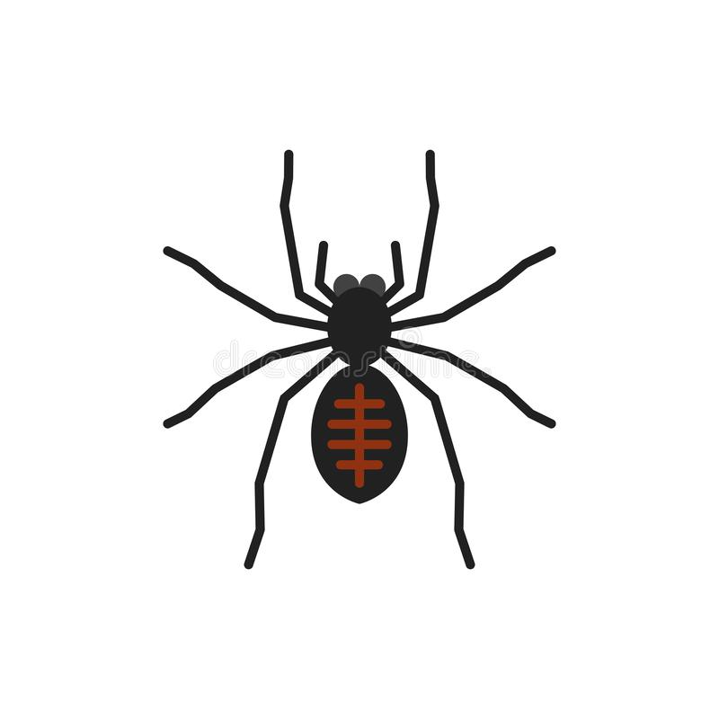

# Project: Spider Attack

This is a shooting video game built with Javascript and the game engine [Phaser](https://phaser.io/).

<!--
*** Thanks for checking out this README Template. If you have a suggestion that would
*** make this better, please fork the repo and create a pull request or simply open
*** an issue with the tag "enhancement".
*** Thanks again! Now go create something AMAZING! :D
-->

<!-- PROJECT SHIELDS -->
<!--
*** I'm using markdown "reference style" links for readability.
*** Reference links are enclosed in brackets [ ] instead of parentheses ( ).
*** See the bottom of this document for the declaration of the reference variables
*** for contributors-url, forks-url, etc. This is an optional, concise syntax you may use.
*** https://www.markdownguide.org/basic-syntax/#reference-style-links
-->
[![Contributors][contributors-shield]][contributors-url]
[![Forks][forks-shield]][forks-url]
[![Stargazers][stars-shield]][stars-url]
[![Issues][issues-shield]][issues-url]

<!-- PROJECT LOGO -->
<br />
<p align="center">
  <a href="https://github.com/PhillipUg/spider-attack">
    
  </a>

  <h1 align="center">Spider Attack</h1>

  <p align="center">
    <a href="https://spider-attack.netlify.app/">View Demo</a>
    ·
    <a href="https://github.com/PhillipUg/spider-attack/issues">Report Bug</a>
    ·
    <a href="https://github.com/PhillipUg/spider-attack/issues">Request Feature</a>
  </p>
</p>

<!-- TABLE OF CONTENTS -->
## Table of Contents

* [About the Project](#about-the-project)
* [How to play](#how-to-play)
* [Installation](#installation)
* [Built With](#built-with)
* [Live Version](#live-version)
* [Future Updates](#future-updates)
* [Contact](#contact)
* [Acknowledgements](#acknowledgements)
* [License](#license)

<br>
<br>
<!-- ABOUT THE PROJECT -->

## About The Project

This is a 2D shooting game. It is only browser-based and built with Phaser 3 game engine. The player's job is to try to avoid a spider infestation. So the player should keep shooting them as they appear from all angles. The main objective of the game is to keep the number of spiders on your back porche below 5. If more than 5 spiders appear, they overwhelm and defeat you.

For each spider you shoot, 50 points will be added to your score. In the end, you will be added to the leaderboard if you come out among the best.

![Product Name Screen Shot][product-screenshot]
<br>

<!-- ![Product Name Screen Shot][product-screenshot2] -->

## How to play
When the game first starts;
* A dialogue box shows up requesting you to enter your name.
* After you enter your name and click `submit`, it takes you to another screen with two buttons, `play` and `credits`.
* Click `play` to start the game.
* To play, all you need to do is point with your cursor and `right-click` to shoot.
* Everytime you `hover` the game screen, the player changes direction following where you move the cursor pointer.


## Installation

To use this app locally, this is what you need to:

* [Download](https://github.com/PhillipUg/spider-attack/archive/master.zip) or clone this repo:
  - Clone with SSH:
  ```
    git@github.com:PhillipUg/spider-attack.git
  ```
  - Clone with HTTPS
  ```
    https://github.com/PhillipUg/spider-attack.git
  ```
* `cd` into the downloaded folder and run `npm install`
* then, run `npm run start`.

### Built With
This project was built using these technologies.
* Phaser 3
* JavaScript
* HTML & CSS
* Netlify (for deployment)
* Webpack
* Jest
* Leaderboard API service

## Live Version
To try it live [click here](https://spider-attack.netlify.app/)

## Future Updates
* Add a health bar
* Make the spiders move towards the player at the center
* Limb movement animation for the spiders
* Make mobile version
* Add more levels and scenes with increasing difficulty
* Add special attack and defence features for spiders and player
* Add Bosses

<!-- CONTACT -->

## Contact

👤 **Phillip Musiime**

- LinkedIn: [Phillip Musiime](https://www.linkedin.com/in/phillip-musiime/)
- GitHub: [PhillipUg](https://github.com/PhillipUg)
- Twitter: [@Phillip_Ug](https://twitter.com/Phillip_Ug)
- E-mail: phillipmusiime@gmail.com


<!-- ACKNOWLEDGEMENTS -->
## Acknowledgements
* [Microverse](https://www.microverse.org/)

<!-- MARKDOWN LINKS & IMAGES -->
<!-- https://www.markdownguide.org/basic-syntax/#reference-style-links -->
[contributors-shield]: https://img.shields.io/github/contributors/PhillipUg/spider-attack.svg?style=flat-square
[contributors-url]: https://github.com/PhillipUg/spider-attack/graphs/contributors
[forks-shield]: https://img.shields.io/github/forks/PhillipUg/spider-attack.svg?style=flat-square
[forks-url]: https://github.com/PhillipUg/spider-attack/network/members
[stars-shield]: https://img.shields.io/github/stars/PhillipUg/spider-attack.svg?style=flat-square
[stars-url]: https://github.com/PhillipUg/spider-attack/stargazers
[issues-shield]: https://img.shields.io/github/issues/PhillipUg/spider-attack.svg?style=flat-square
[issues-url]: https://github.com/PhillipUg/spider-attack/issues
[product-screenshot]: assets/content/spider-attack.gif
<!-- [product-screenshot2]: dist/images/page2.png -->


## 📝 License

This project is [MIT](https://opensource.org/licenses/MIT) licensed.